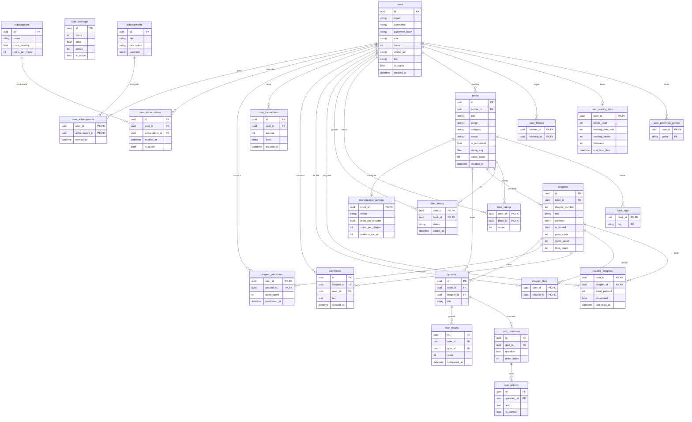

# Inkly — Book Platform

Plataforma de lectura y escritura de libros con sistema de monetización, quizzes y logros.

## Stack tecnológico

| Capa | Tecnología |
|---|---|
| Frontend | Angular 19 + Tailwind CSS 3 |
| Backend | FastAPI + Python 3.12 |
| Base de datos | PostgreSQL 16 |
| Almacenamiento | MinIO (S3-compatible) |
| ORM | SQLAlchemy 2 (async) |
| Migraciones | Alembic |

## Estructura del proyecto

```
book-platform/
├── backend/          # API REST con FastAPI
│   ├── app/
│   │   ├── core/     # Config, DB, seguridad
│   │   ├── models/   # Modelos SQLAlchemy
│   │   ├── routers/  # Endpoints
│   │   ├── schemas/  # Schemas Pydantic
│   │   └── services/ # Lógica de negocio
│   └── alembic/      # Migraciones
├── frontend/         # SPA Angular
│   └── src/app/
│       ├── core/     # Guards, interceptors, servicios
│       ├── features/ # Páginas (auth, reader, writer)
│       └── shared/   # Componentes reutilizables
├── docker-compose.yml      # Producción
└── docker-compose.dev.yml  # Desarrollo local
```

## Desarrollo local

### Requisitos
- Python 3.12+
- Node.js 20+
- Docker Desktop

### 1. Levantar infraestructura

```bash
docker compose -f docker-compose.dev.yml up -d
```

Esto arranca PostgreSQL en el puerto `5432` y MinIO en el `9000`.

### 2. Backend

```bash
cd backend
python3 -m venv .venv
.venv\Scripts\activate        # Windows
source .venv/bin/activate     # Linux/Mac

pip install -e ".[dev]"
alembic upgrade head
uvicorn app.main:app --reload --port 8000
```

API disponible en `http://localhost:8000`
Documentación interactiva en `http://localhost:8000/docs`

### 3. Frontend

```bash
cd frontend
npm install
npm install -D tailwindcss@3 autoprefixer
npm start
```

Aplicación disponible en `http://localhost:4200`

## Producción

Crea un fichero `.env` en la raíz con las variables de entorno:

```env
DB_PASSWORD=contraseña_segura
SECRET_KEY=clave_secreta_larga
MINIO_USER=admin
MINIO_PASSWORD=contraseña_minio
ALLOWED_ORIGINS=https://tudominio.com
```

Lanza todo el stack con:

```bash
docker compose up -d --build
```

## Esquema de base de datos



## Funcionalidades

- Registro e inicio de sesión con JWT
- Roles: lector y escritor
- Editor de libros con capítulos
- Sistema de coins y monetización
- Quizzes por libro
- Logros y estadísticas de lectura
- Biblioteca personal
- Comentarios y valoraciones
